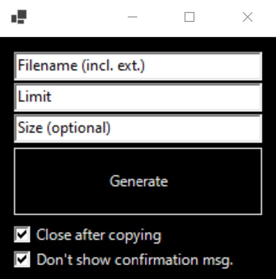

# Obsidian Image File Namer

Creates attachment file links for Obsidian notes. Best used in conjunction with either a batch file renamer (e.g. Bulk Rename for Windows) 
or the Paste Image Rename plugin for Obsidian.  
Currently offers only Wiki style links (e.g. `![[file]]`), but will add support for Markdown links (e.g. ``) soon, along with 
customisable filenames (right now the default & sole option is e.g. filename-1.ext).

# GUI Screenshot

# Output Screenshot (Obsidian Source Mode)

